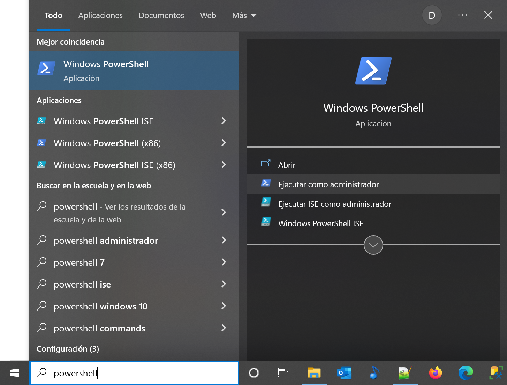
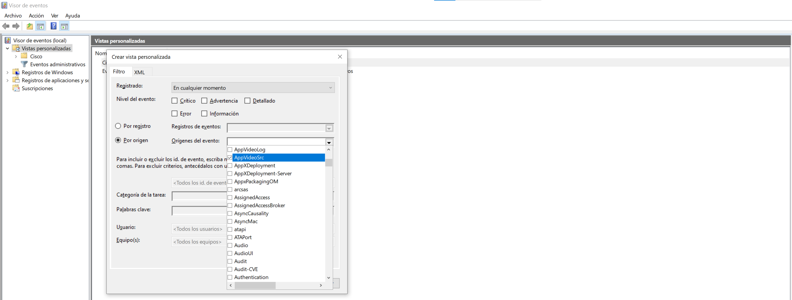
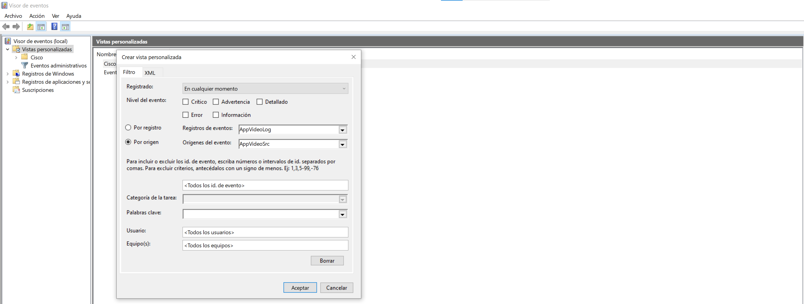

# logfile2windowsevent

Scan a live log file and generate windows events when a log file line contains a certain text.

# Objetivo

Esta utilidad monitoriza un **fichero vivo de log de aplicación**,
y si en una nueva línea encuentra un patrón determinado de texto
generará un **evento** en un **log de Windows** del **registro de eventos Windows**.

# Definiciones

- **Fichero vivo de log de aplicación**:
  - El fichero de texto plano donde una aplicación anota su actividad generando una nueva línea descriptiva de cada acción significativa que realice o resultado inesperado que obtenga.
  - Este fichero está abierto y bloqueado por la aplicación mientras esta ejecute, permitiendo sólo la lectura.
- **Registro de eventos Windows**:
  - Cada ocurrencia de un evento (acción, error de un programa o de un servicio, inicio de sesión, etc.) se recoge en los registros de Windows. Estos son el equivalente de los logs para el sistema operativo. Así, la información contenida permite resolver problemas en Windows y también en otros programas instalados en el equipo.
  - Internamente se organiza en diversos **logs de Windows** dentro de cada uno de los cuales los eventos se pueden asociar a diversos **orígenes** y **Categorías**
- **Log de Windows**
  - Primer nivel de clasificación lógica de los **eventos ** en el **registro de eventos Windows**.
- **Origen de eventos**
  - Atributo de un **evento** en el **registro de eventos Windows** que constituye el segundo nivel de clasificación de eventos. Se asocia a una aplicación, módulo de software, etc.
  - Dentro de un **log de Windows** se puede definir al menos una origen.
  - En inglés, _source_.
- **Categoría de eventos**
  - Atributo de un **evento** en el **registro de eventos Windows** que permite clasificar eventos si se usa.
  - Para definir categorías de eventos es necesario crear un _category message file_, compilarlo a fichero de recursos con una primera herramienta de desarrollo, y transformar este fichero de recursos en una DLL con una segunda herramienta de desarrollo.
  - Este script de monitorización de ficheros de log y generación de eventos usa solo las herramientas de Windows por defecto (PowerShell) y de momento no entra al uso de categorías en aras de la simplicidad de uso.
- **Visor de eventos de Windows**:
  - Aplicación de sistema de Windows que permite ver los diversos eventos en el registro.
- **Evento**
  - Entrada lógica del **registro de eventos de Windows**.
  - Clasificado dentro de un **log de Windows** y un **origen de eventos**
  - Muestra estos atributos en el visor de eventos para un **log** y opcionalmente **origen** dados:
    - **Nivel** Gravedad del evento: Informativo, advertencia, error...
    - **Fecha y hora** Momento en que sucedió.
    - **Origen** Aplicación, módulo que causó el evento.
    - **Id. del evento** Identificador único del tipo de evento.
    - **Categoría** Clasificación arbitraria del evento. Sin el uso de ficheros descriptivos de categorías compilados en DLL, los eventos insertados por este script mostrarán un número como categoría.

Visor de eventos de windows (ejecutar _eventvwr.msc_)


# Tutorial

## Inicio rapido

Ejecutar QuickStart.bat
Se abriran las 2 consolas necesarias

## Generar eventos del tutorial

- Descargar a local el código de este sitio github, con clone o en un zip.

- Arrancar Powershell como administrador. Esto evita tener que registrar los scripts descargados, tarea que harán los administradores para ejecutar luego en producción.



Ejecutar el comando para entrar en la consola de powershell:

```
powershell
```

- En la consola de Powershell, ir al directorio que contiene los scripts.

```
PS C:\> cd C:\...\logfile2windowsevent
```

- Arrancar el generador de log ejemplo (_log/generated.log_):

```
PS C:\...\logfile2windowsevent>powershell -ExecutionPolicy Bypass -NoProfile -File .\generaLog.ps1
```

Este generador de log añade una linea cada dos segundos,
y cada tres o cada cuatro lineas el contenido de esa linea
es una frase aleatoria en latín con el prefijo **TRIVIUM:** o **QUADRIVIUM:**
según la periodicidad de la línea.

```
01/19/2023 09:46:06 - 0 - QUADRIVIUM: Aenean fringilla non ligula a rutrum.
01/19/2023 09:46:08 - 1 - Doin' stuff'n'shit
01/19/2023 09:46:10 - 2 - Doin' stuff'n'shit
01/19/2023 09:46:12 - 3 - TRIVIUM: Orci varius natoque penatibus et magnis dis parturient montes, nascetur ridiculus mus.
01/19/2023 09:46:14 - 4 - QUADRIVIUM: Quisque fringilla tempor nulla.
01/19/2023 09:46:16 - 5 - Doin' stuff'n'shit
01/19/2023 09:46:18 - 6 - TRIVIUM: Suspendisse potenti.
01/19/2023 09:46:20 - 7 - Doin' stuff'n'shit
01/19/2023 09:46:22 - 8 - QUADRIVIUM: Quisque faucibus odio erat, sed laoreet dolor porttitor a.
01/19/2023 09:46:24 - 9 - TRIVIUM: Duis iaculis, lectus at ullamcorper accumsan, arcu elit pharetra orci, a finibus augue nibh aliquam arcu.
01/19/2023 09:46:26 - 10 - Doin' stuff'n'shit
01/19/2023 09:46:28 - 11 - Doin' stuff'n'shit
01/19/2023 09:46:30 - 12 - QUADRIVIUM: Vestibulum ante ipsum primis in faucibus orci luctus et ultrices posuere cubilia curae; Suspendisse vitae dignissim turpis.
01/19/2023 09:46:32 - 13 - Doin' stuff'n'shit
01/19/2023 09:46:34 - 14 - Doin' stuff'n'shit
```

- Arrancar el scipt de escucha de log y generación de eventos. Interrumpirlo (_Ctr-C_) cuando haya registrado unos cuatro eventos.

```
PS C:\...\logfile2windowsevent> powershell -ExecutionPolicy Bypass -NoProfile -File .\listenLogGenEvents.ps1
```

```
Textos a buscar en los logs, y el id de evento que se asociará a cada uno de ellos
TRIVIUM: -> 2001 [Warning]
QUADRIVIUM: -> 2002 [Error]
Creando la fuente de eventos AppVideoSrc en el event log AppVideoLog
Log:   01/19/2023 10:59:15 - 8 - QUADRIVIUM: Quisque faucibus odio erat, sed laoreet dolor porttitor a.
Event: 2002 [Error] Quisque faucibus odio erat, sed laoreet dolor porttitor a.
Log:   01/19/2023 10:59:17 - 9 - TRIVIUM: Duis iaculis, lectus at ullamcorper accumsan, arcu elit pharetra orci, a finibus augue nibh aliquam arcu.
Event: 2001 [Warning] Duis iaculis, lectus at ullamcorper accumsan, arcu elit pharetra orci, a finibus augue nibh aliquam arcu.
Log:   01/19/2023 10:59:23 - 12 - QUADRIVIUM: Vestibulum ante ipsum primis in faucibus orci luctus et ultrices posuere cubilia curae; Suspendisse vitae dignissim turpis.
Event: 2002 [Error] Vestibulum ante ipsum primis in faucibus orci luctus et ultrices posuere cubilia curae; Suspendisse vitae dignissim turpis.
Log:   01/19/2023 10:59:29 - 15 - TRIVIUM: Duis mattis dolor a dolor feugiat semper.
Event: 2001 [Warning] Duis mattis dolor a dolor feugiat semper.
Ctrl-C
PS C:\...\logfile2windowsevent>
```

El inicio del script informa:

- Qué marcas de texto (TRIVIUM y QUADRIVIUM) se buscará en cada línea del fichero de log.
- Para cada marca el id de evento de Windows que se generará y su nivel.

```
Textos a buscar en los logs, y el id de evento que se asociará a cada uno de ellos
TRIVIUM: -> 2001 [Warning]
QUADRIVIUM: -> 2002 [Error]
```

Dado que no existe ni el log ni la fuente en el registro de eventos de Windows, se informa de su creación.

```
Creando la fuente de eventos AppVideoSrc en el event log AppVideoLog
```

Cada vez que en una línea del log se encuentra una marca, se muestra esa línea
y el id, nivel y mensaje para el evento de Windows generado.

```
Log:   01/19/2023 10:59:15 - 8 - QUADRIVIUM: Quisque faucibus odio erat, sed laoreet dolor porttitor a.
Event: 2002 [Error] Quisque faucibus odio erat, sed laoreet dolor porttitor a.
```

## Ver eventos del tutorial

- Ejecutar _eventvwr.msc_

- Crear una vista personalizada:


- Seleccionar _por origen_ la fuente _AppVideoSrc_:



- Queda seleccionada la fuente/origen y el log \*AppVideoLog\*\*



- No son necesarios más criterios de selección para un tutorial. Aceptar.

- Dar un nombre y descripción, y si se prefiere situar la vista en el árbol delEvent Viewer. Aceptar.


- Ya se pueden observar los eventos generados:


- El evento más reciente aparece el primero de la lista.
- Se ha categorizado en la categoría (3) (no hay _category name file_) por tener la marca TRIVIUM.
- Se ha tomado como mensaje para la pestaña **General** el texto que sigue a la marca.
- La fecha de generación del evento es la de su inserción en el registro por Powershell, no la del fichero de log.

```
Log:   01/19/2023 10:59:29 - 15 - TRIVIUM: Duis mattis dolor a dolor feugiat semper.
Event: 2001 [Warning] Duis mattis dolor a dolor feugiat semper.
```

# Paso a producción

## Ejecución

A implementar al gusto del usuario.

- Se sugiere crear un servicio de Windows. Este enlace no se ha probado pero tiene buen aspecto
  - [https://woshub.com/run-powershell-script-as-windows-service/](https://woshub.com/run-powershell-script-as-windows-service/)

## Configuración

Toda la configuración está en el propio `listenLogGenEvents.ps1`
entre dos marcas `Configurar`.
El resto del fichero no se debe editar.

```
# -------------------------------------------------------------------------------------------------------------------
# Configurar
...
# /Configurar
# -------------------------------------------------------------------------------------------------------------------
```

Situación del fichero de log monitorizado

```
$logFile = "log\generated.log"
```

Event log de Windows a escribir. Si no existe, el script la creará.

```
$paramLog = "AppVideoLog"
```

Source de los eventos en el event log. Si no existe, el script la creará.

```
$paramSource = "AppVideoSrc"
```

Define los eventos que se pueden obtener del log

- mark: Texto que se espera encontrar en una línea del fichero de log.
- eventCode: Código de evento de Windows que se genera.
- eventType: Tipo de evento ('Warning', 'Error', 'Information'...)
- category: Número de categoría del evento

```
$events =@(
	[pscustomobject]@{mark="TRIVIUM:";   eventCode=2001;eventType='Warning';category=3},
	[pscustomobject]@{mark="QUADRIVIUM:";eventCode=2002;eventType='Error';  category=4}
)
```

Definir la conversión de linea del fichero de log en mensaje del event log.
Para cada log analizado se hará una función de extracción del mensaje de la línea.
Se puede devolver la propia línea y adelante con `return $LogLine`.

```
function logLine2eventMessage{
	Param(
		[String]$LogLine,  # La linea completa del fichero de log
		[String]$EventMark # La marca de evento que se ha encontrado en la linea del fichero de log
	)
	# Ejemplo: Devuelve como mensaje lo que viene detrás de la marca de evento en la linea del fichero de log
	return $LogLine.Substring( $LogLine.indexOf($EventMark) + $EventMark.Length ).Trim()
}
```

N.B. Para limpiar pruebas, ejecutar en este orden y con las variables informadas

```
$logFile = "log\generated.log"
$paramLog = "AppVideoLog"
Remove-EventLog -Source  $paramSource
Remove-EventLog -LogName $paramLog
```

## Creación de custom views en el Event Viewer

Las _custom views_ del _event viewer_ se pueden crear guardando un XML
en un directorio especial de Windows, o en uno de sus subdirectorios.

Powershell es necesario solo para escibir con un `-Force` debido a los
permisos especiales de ese directorio (probado en una sesión de PS que ya de por si tenía permisos elevados de Administrador).

La carpeta especial es `%ProgramData%\Microsoft\Event Viewer\Views`.

```
$templateStoragePath = Join-Path $env:ProgramData 'Microsoft\Event Viewer\Views'
```

Ejemplo de como definir una vista a la fuente `AppVideoSrc` en el log `AppVideoLog`.

```
$xmlTemplate = @"
<ViewerConfig>
  <QueryConfig>
    <QueryParams>
         <Simple>
            <Channel>AppVideoLog</Channel>
            <RelativeTimeInfo>0</RelativeTimeInfo>
            <Source>AppVideoSrc</Source>
            <BySource>True</BySource>
         </Simple>
    </QueryParams>
    <QueryNode>
         <Name LanguageNeutralValue="Hecho a mano">Hecho a mano</Name>
         <Description>Generar eventos test</Description>
         <QueryList>
            <Query Id="0" Path="AppVideoLog">
               <Select Path="AppVideoLog">*[System[Provider[@Name='AppVideoSrc']]]</Select>
            </Query>
         </QueryList>
    </QueryNode>
  </QueryConfig>
</ViewerConfig>
"@
```

La definición se guarda en el subdirectorio `Tutorial` dela carpeta especial, con el nombre `ejemplo.xml`.

```
$subdir="Tutorial"
$fichero="ejemplo.xml"
$outputPath = Join-Path $templateStoragePath ($subdir+"\"+$fichero)
```

Se aplica todo lo anterior por las bravas con `-Force`.

```
$xmlTemplate | Out-File -FilePath $outputPath -Force
```

# Version final del script

Consultar el script [installFullEquip.ps1](installFullEquip.ps1)

- Las definiciones de `$paramLog` y `$paramSource` deben coincidir en `installFullEquip.ps1` y `listenLogGenEvents.ps1`.
- El script no incluye la automatización de la creación de un servicio. Ver siguiente partado.

# Creación de un servicio Windows

El script de instalación no incluye la automatización de la creación de un servicio.
Se recomienda probar lo descrito en este apartado en las máquinas destino y una vez afianzado incorporarlo al script.

Detalles en [https://woshub.com/run-powershell-script-as-windows-service/](https://woshub.com/run-powershell-script-as-windows-service/).

## Instalar NSSM: The non-sucking service manager

La página [https://nssm.cc/](https://nssm.cc/) advierte que NSSM es un solo ejecutable
que basta con que esté en el path.

Todo lo que sigue se puede usar en un PC de desarrollo para obtenerlo, o simplemente descargarlo de la web y copiar `nssm.exe`en algún lugar del path.

En un directorio temporal. Única instrucción, separada por \`.

```
Set-ExecutionPolicy Bypass -Scope Process -Force; `
iex ((New-Object System.Net.WebClient).DownloadString('https://chocolatey.org/install.ps1'))
```

Luego

```
choco install nssm
```

Validar:

```
choco -v
	1.3.0

nssm -v
	NSSM 2.24-101-g897c7ad 64-bit 2017-04-26
```

## Instalar el servicio propiamente dicho

Una vez NSSM esté en el path, instalar el servicio propiamente dicho.

Configura el nombre de servicio

```
$NewServiceName = "AppVideoLogListener"
```

TODO: Verificar que estos dos `Get-Command` devuelven un String que apunta a los respectivos ejecutables.

```
$PoShPath= (Get-Command powershell).Source
$NSSMPath = (Get-Command nssm.exe).Source
```

Apuntar al path absoluto del fichero del listener.

El propio listener tambien debe tener el path absoluto del log en la configuración en $logFile.

```
$PoShScriptPath = "C:\_exe\Justicia\Fuentes\logfile2windowsevent\listenLogGenEvents.ps1"
```

Estos tres comandos se ejecutan juntos en una sola linea.

```
$args = '-ExecutionPolicy Bypass -NoProfile -File "{0}"' -f $PoShScriptPath
& $NSSMPath install $NewServiceName $PoShPath $args
& $NSSMPath status $NewServiceName
	Service "AppVideoLogListener" installed successfully!
	SERVICE_STOPPED
```

Despues de lo anterior, el servicio aparece creado en la consola de servicios, con arranque automático.

Antes de arrancar el servicio, asegurarse de que se ha ejecutado `installFullEquip.ps1` y existe la correspondiente vista personalizada en Visor de eventos.

Para arrancar un servicio:

```
Start-Service $NewServiceName
```

Para obtener información del servicio

```
Get-Service -DisplayName "$NewServiceName"
```

Para eliminar un servicio si estamos en PS versión 6 o mayor.

```
Get-Service -DisplayName "$NewServiceName" | Remove-Service
```

En versiones anteriores de PS habrá que usar otros métodos,
ver [https://www.itprotoday.com/compute-engines/how-do-i-delete-service](https://www.itprotoday.com/compute-engines/how-do-i-delete-service)

```
Get-Host | Select-Object Version
	Version
	-------
	5.1.19041.2364
```

Pruebas efectuadas:

- Arrancado el generador de log de pruebas en los scripts.
- Arrancado el servicio y a ratos pararlo y volver a arrancar.
- Visto como el Visor de eventos captura los eventos, y solo mientras el servicio está arrancado.
